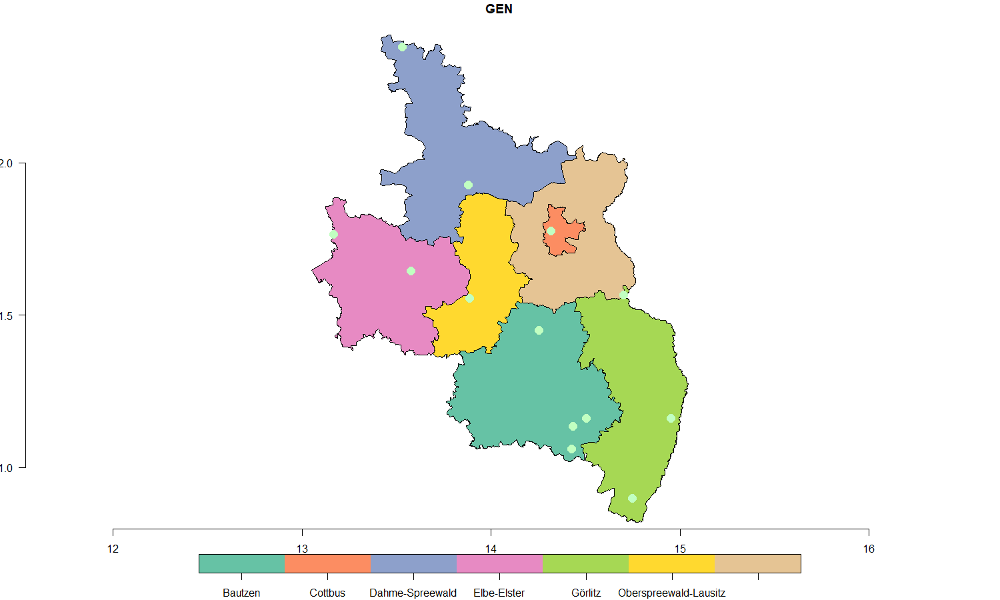

# Spatial-Analysis-of-Climate-Data-Stations-in-Lausitz

This repository focuses on a detailed spatial analysis of climate data stations located within the Lausitz (Lusatia) region of Germany.

## Overview and Code Walkthrough

### 1. Loading Essential Libraries
The script begins by importing the necessary R libraries.

```{r }
library(rdwd)
library(tidyverse)
library(sf)
library(raster)
library(berryFunctions)
```

### 2. Setting the Working Directory
The working directory is set to ensure the script accesses the right files.
```{r }
setwd("D:/Users/konlavach/Desktop/rdwd/usecase/7_Heatwaves_Lausitz")
```

### 3. Data Selection
We load and filter the metaIndex dataset to select relevant climate data.
```{r }
data("metaIndex")
m <- metaIndex
m <- m[m$res=="daily" & m$var=="kl" & m$per=="recent" & m$hasfile, ]
```

### 4. Spatial Transformation
The climate stations metadata is converted into spatial objects using their longitude and latitude.
```{r }
msf <- sf::st_as_sf(m, coords=c("geoLaenge", "geoBreite"), crs=4326)
```

### 5. Reading District Boundaries
A shapefile that contains the administrative boundaries of the Lausitz region is read into the script.
```{r }
lk <- sf::st_read("Lusatia_Administrative_Boundary_geom_info.shp", quiet=TRUE)
```

### 6. Intersection Analysis
The district shapefile's coordinate system is matched with the climate stations' system. Intersections between the district boundaries and climate station locations are then determined.
```{r }
lk = st_transform(lk, crs = st_crs(msf))
int <- sf::st_intersects(lk, msf)
```

### 7. Visualization
The districts are plotted, and for each district, the contained climate stations are marked using green points.
```{r }
plot(lk[,"GEN"], reset=FALSE)
axis(1, line=-1); axis(2, line=-1, las=1)

# Repeated for each district:
lk$GEN[[1]]
m[int[[1]], c("Stationsname", "geoLaenge", "geoBreite")]
points(m[int[[1]], c("geoLaenge", "geoBreite")], pch=16, col= "darkseagreen1", cex=1.8)

# ... [Similar code for other districts]
```

### 8. Compiling Stations Data
A consolidated list of all climate stations across the seven districts is compiled and displayed.

```{r }
lausitz = c(int[[1]], int[[2]], int[[3]], int[[4]], int[[5]], int[[6]], int[[7]])
lausitz_stations = m[lausitz,]
head(lausitz_stations)
lausitz_stations$Stationsname
```

## Objective
The primary aim of this analysis is to visualize the locations of climate data stations within various districts of the Lausitz region, providing insights into their distribution and coverage.


<!-- -->


